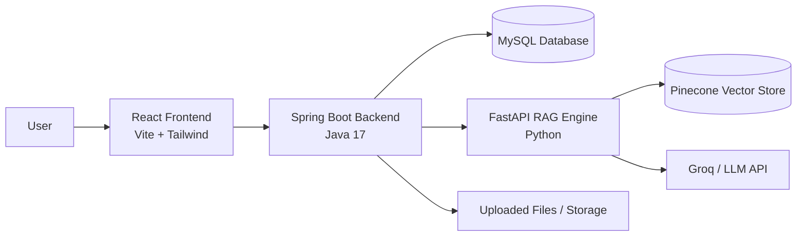

# Syllabex — Intelligent Study Assistant

Syllabex is a full-stack academic assistant designed to help students, faculty, and administrators interact with study materials through a conversational interface backed by a Retrieval-Augmented Generation (RAG) pipeline. The system combines a Spring Boot backend, a React frontend, and a Python-based RAG engine to provide secure authentication, document ingestion, semantic search, and AI-powered question answering.

## Overview

This repository contains three primary components:

- `syllabex-backend` — Java 17 / Spring Boot 3 backend for authentication, authorization, chat orchestration, document management, and MySQL persistence.
- `syllabex-frontend` — React + Vite frontend for the web application interface.
- `rag_system` — Python FastAPI-based RAG engine responsible for document processing, embedding generation, vector storage, retrieval, and LLM-powered answer generation.

Together, these services form a complete intelligent study platform with role-based access and grounded AI responses.

## Key Features

- Role-based access control for students, faculty, and administrators
- Google OAuth-based student login flow
- JWT-based session authentication
- Chat history and session management
- Document upload and ingestion for study materials
- AI-powered Q&A using RAG over uploaded documents
- Vector search with Pinecone-backed indexing
- MySQL persistence for users, documents, and chat records
- Modern responsive web UI built with React and Tailwind CSS

## Architecture



## Tech Stack

| Layer | Technology |
| --- | --- |
| Backend | Java 17, Spring Boot 3.2, Spring Security |
| Frontend | React 18, Vite, Tailwind CSS |
| Database | MySQL 8 |
| Authentication | JWT, Google OAuth |
| RAG Engine | Python, FastAPI |
| Embeddings | Hugging Face / Qwen-based embedding model |
| Vector Store | Pinecone |
| LLM Integration | Groq API |
| Document Processing | PyMuPDF, python-docx, python-pptx |

## Repository Structure

```text
RagBot/
├── README.md
├── rag_system/
│   ├── api/
│   ├── document_processor/
│   ├── embedder/
│   ├── llm/
│   ├── retriever/
│   ├── vector_store/
│   ├── config.py
│   ├── main.py
│   ├── pipeline.py
│   ├── requirements.txt
│   └── ...
├── syllabex-backend/
│   ├── src/
│   ├── pom.xml
│   └── README.md
├── syllabex-frontend/
│   ├── src/
│   ├── package.json
│   └── README.md
└── .gitignore
```

## System Components

### 1. Frontend (`syllabex-frontend`)
The frontend provides the user-facing web application where students and staff can:

- Sign in and authenticate
- Ask AI questions
- View chat sessions and responses
- Upload academic documents
- Access role-specific dashboards

### 2. Backend (`syllabex-backend`)
The backend acts as the core orchestration layer. It handles:

- Authentication and authorization
- User and role management
- Chat session creation and retrieval
- Document upload workflow
- HTTP communication to the Python RAG service
- Persistence in MySQL

### 3. RAG Engine (`rag_system`)
The RAG engine processes uploaded study materials and provides grounded responses. It performs:

- Document extraction from PDF, DOCX, and PPTX files
- Chunking and preprocessing
- Embedding generation
- Vector indexing in Pinecone
- Similarity search for retrieval
- LLM-based answer generation using the retrieved context

## Getting Started

### Prerequisites

Before running the project locally, ensure the following tools are installed:

- Java 17+
- Maven 3.6+
- Node.js 18+
- npm
- MySQL 8+
- Python 3.10+
- A Pinecone account and API key
- A Groq API key

## Local Development Setup

### 1. Clone the Repository

```bash
git clone https://github.com/mathavmady/RagBot.git
cd RagBot
```

### 2. Configure the RAG Engine

Go to the Python project directory and install dependencies:

```bash
cd rag_system
python -m venv venv
source venv/bin/activate   # On Windows: venv\Scripts\activate
pip install -r requirements.txt
```

Create a `.env` file in `rag_system/` with the required environment variables:

```env
PINECONE_API_KEY=your_pinecone_key
PINECONE_INDEX_NAME=rag-system
GROQ_API_KEY=your_groq_key
LLM_MODEL_NAME=llama-3.1-8b-instant
EMBEDDING_MODEL_NAME=Qwen/Qwen3-Embedding-0.6B
API_HOST=0.0.0.0
API_PORT=8000
```

Run the RAG service:

```bash
python main.py
```

The API documentation will be available at:

```text
http://localhost:8000/docs
```

### 3. Configure and Start the Backend

```bash
cd syllabex-backend
mvn clean install
mvn spring-boot:run
```

The backend runs on:

```text
http://localhost:8080
```

### 4. Configure and Start the Frontend

```bash
cd syllabex-frontend
npm install
npm run dev
```

The frontend usually runs on:

```text
http://localhost:5173
```

## Environment Variables

### Backend (`syllabex-backend/src/main/resources/application.properties`)
The backend uses the following key variables:

```env
DB_HOST=localhost
DB_PORT=3306
DB_NAME=syllabex_db
DB_USER=root
DB_PASSWORD=your_password
JWT_SECRET=your_jwt_secret
GOOGLE_CLIENT_ID=your_google_client_id
FASTAPI_URL=http://localhost:8000
UPLOAD_DIR=uploads
```

### RAG Engine (`rag_system/.env`)
```env
PINECONE_API_KEY=your_pinecone_key
PINECONE_INDEX_NAME=rag-system
PINECONE_CLOUD=aws
PINECONE_REGION=us-east-1
GROQ_API_KEY=your_groq_key
EMBEDDING_MODEL_NAME=Qwen/Qwen3-Embedding-0.6B
LLM_MODEL_NAME=llama-3.1-8b-instant
API_HOST=0.0.0.0
API_PORT=8000
```

## Default Admin Account

The backend includes a default admin account for local development or initial setup. The application properties define the following values:

- Email: `adminkncet@gmail.com`
- Password: `admin123`

Important: Change these values before deploying to a production or shared environment.

## Use Cases

This project is designed for academic environments where users need:

- Instant answers from course materials
- Search across large uploaded study documents
- Document-based AI assistance for learning
- Role-based administrative workflows
- Secure and efficient academic support tools

## Development Notes

- The backend is the system of record for users, chat sessions, and document metadata.
- The RAG engine is stateless and focuses purely on ingestion, retrieval, and generation.
- Document ingestion should follow a robust validation and cleanup flow before production use.
- Ensure your API keys and database credentials are managed securely in production.

## Troubleshooting

### Common Issues

- Backend fails to connect to MySQL: verify DB credentials and ensure MySQL is running.
- RAG API fails on startup: confirm `PINECONE_API_KEY` and `GROQ_API_KEY` are defined.
- Frontend cannot fetch backend data: verify the API base URL and CORS settings.
- Document ingestion returns no results: confirm the uploaded file is supported and the RAG engine is reachable.

## License

This project does not currently include a license file. If you plan to publish or distribute it, it is recommended to add an appropriate open-source license.

## Contributing

Contributions are welcome. If you want to improve the project:

1. Fork the repository.
2. Create a feature branch.
3. Make your changes.
4. Run tests and validate the build.
5. Submit a pull request with a clear description.

## Contact

For questions or collaboration opportunities, contact the repository owner or maintainers through the GitHub project page.

---

This README reflects the current structure and purpose of the repository and is intended to be readable, professional, and suitable for onboarding new developers and collaborators.
