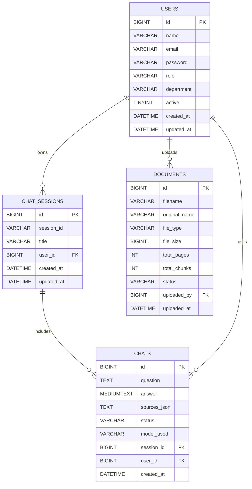
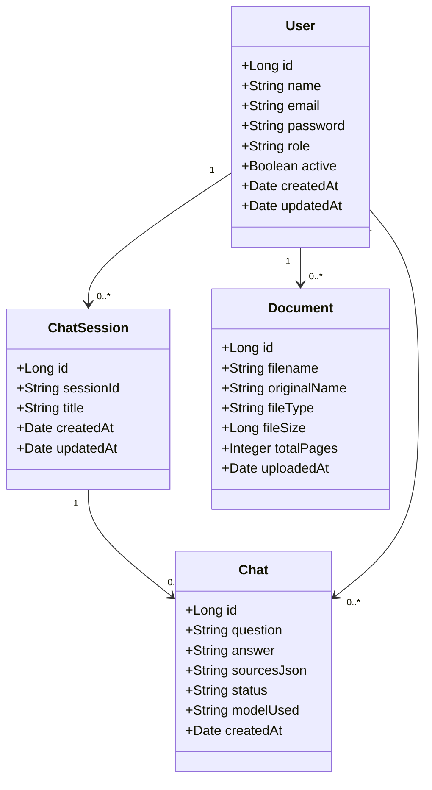

# Syllabex — Intelligent Study Assistant

A full-stack intelligent study assistant that provides conversational Q&A, document ingestion and indexing, and session-based chat.

- Backend: Spring Boot (Java 17, Spring Boot 3.2.x)
- Frontend: React + Vite
- Persistence: MySQL
- External: FastAPI-based RAG engine (configurable)

## Quick links to important files

- Backend POM: [pom.xml](D:/Ragbot/RagBot/syllabex-backend/pom.xml)
- Backend schema (reference): [schema.sql](D:/Ragbot/RagBot/syllabex-backend/src/main/resources/schema.sql)
- Backend config: [application.properties](D:/Ragbot/RagBot/syllabex-backend/src/main/resources/application.properties)
- Frontend manifest: [package.json](D:/Ragbot/RagBot/syllabex-frontend/package.json)
- Frontend entry: [index.html](D:/Ragbot/RagBot/syllabex-frontend/index.html)

## Table of contents

- Goals and scope
- Architecture overview
- System components & responsibilities
- ER diagram (database)
- UML / domain model
- Local development — commands to run
- Environment variables and configuration
- Suggested CI / GitHub Actions workflow
- Recommended Docker Compose snippet
- Troubleshooting & tips
- Where to look in the code

---

## 1) Goals and scope

Provide a production-oriented backend to manage users, chat sessions, documents and chat history, and a SPA frontend for interactive conversational UX. The backend orchestrates calls to an external FastAPI RAG engine for indexing and retrieval.

## 2) Architecture overview

- Frontend (React + Vite)
  - Handles authentication (Google OAuth + JWT flows), chat UI, document upload, and visualizations.
- Backend (Spring Boot)
  - JWT auth, user/session management, file upload handling, orchestration to FastAPI via WebClient (WebFlux).
- External RAG Engine (FastAPI)
  - Indexing, vector store, retrieval, and LLM prompt orchestration.
- Database (MySQL)
  - Stores users, chat_sessions, chats, documents.
- Upload storage
  - Local or object storage configured by `UPLOAD_DIR`.

### Architecture diagram (Mermaid)

```mermaid
flowchart LR
  A[User Browser] -->|HTTPS| F(Frontend - React + Vite)
  F -->|REST / WebSocket| B(Backend - Spring Boot)
  B -->|JDBC| M[(MySQL)]
  B -->|HTTP (WebClient)| R[FastAPI RAG Engine]
  B -->|File writes| S[Uploads directory / Object Storage]
  R -->|Vector Store / Index| V[(Vector DB / Index)]
  style F fill:#f3f4f6, stroke:#111827
  style B fill:#eef2ff, stroke:#1e293b
  style R fill:#ecfccb, stroke:#365314
```

## 3) System components & responsibilities

- Frontend (syllabex-frontend)
  - React 18 + Vite. See [package.json](D:/Ragbot/RagBot/syllabex-frontend/package.json).
  - Scripts: `dev` (vite), `build`, `preview`.
- Backend (syllabex-backend)
  - Spring Boot 3.2.x (Java 17). See [pom.xml](D:/Ragbot/RagBot/syllabex-backend/pom.xml).
  - Responsibilities: auth (JWT), persistence (JPA), upload endpoints, orchestration to FastAPI.

## 4) ER diagram (derived from schema.sql)



## 5) UML / Domain model



## 6) Local development — commands to run

Prerequisites
- Java 17
- Maven 3.6+
- Node 18+
- npm (or yarn/pnpm)
- MySQL (or dockerized MySQL)
- Optional: FastAPI RAG engine (default `http://localhost:8000`)

Backend (port 8080)
- Build: `mvn -f syllabex-backend clean package`
- Run (dev): `mvn -f syllabex-backend spring-boot:run`
- Run jar: `java -jar syllabex-backend/target/syllabex-backend-1.0.0.jar`

Frontend (Vite, default 5173)
- cd syllabex-frontend
- npm ci
- npm run dev
- npm run build
- npm run preview

## 7) Environment variables and configuration

Key properties (see `syllabex-backend/src/main/resources/application.properties`):

- DB_HOST (default: localhost)
- DB_PORT (default: 3306)
- DB_NAME (default: syllabex_db)
- DB_USER (default: root)
- DB_PASSWORD (set in environment)
- JWT_SECRET (app.jwt.secret) — change for production (>=256-bit)
- FASTAPI_URL (app.fastapi.base-url) — default `http://localhost:8000`
- UPLOAD_DIR (app.upload.dir)

Example (PowerShell):
```powershell
$env:DB_HOST='127.0.0.1'; $env:DB_USER='root'; $env:DB_PASSWORD='password'; mvn -f syllabex-backend spring-boot:run
```

## 8) Suggested CI / GitHub Actions workflow (example)

```yaml
name: CI
on:
  push:
    branches: [ main ]
  pull_request:
    branches: [ main ]

jobs:
  build-backend:
    runs-on: ubuntu-latest
    steps:
      - uses: actions/checkout@v4
      - name: Set up JDK 17
        uses: actions/setup-java@v4
        with:
          distribution: temurin
          java-version: 17
      - name: Build backend
        run: mvn -f syllabex-backend -B clean package -DskipTests=true

  build-frontend:
    runs-on: ubuntu-latest
    needs: build-backend
    steps:
      - uses: actions/checkout@v4
      - name: Use Node.js
        uses: actions/setup-node@v4
        with:
          node-version: 18
      - name: Install & build frontend
        working-directory: syllabex-frontend
        run: |
          npm ci
          npm run build
```

## 9) Recommended Docker Compose (local dev snippet)

```yaml
version: '3.8'
services:
  db:
    image: mysql:8.0
    environment:
      MYSQL_ROOT_PASSWORD: rootpass
      MYSQL_DATABASE: syllabex_db
    ports:
      - "3306:3306"
    healthcheck:
      test: ["CMD","mysqladmin","ping","-h","localhost"]
      interval: 10s
      retries: 5

  backend:
    build:
      context: ./syllabex-backend
      dockerfile: Dockerfile
    environment:
      DB_HOST: db
      DB_PORT: 3306
      DB_NAME: syllabex_db
      DB_USER: root
      DB_PASSWORD: rootpass
      JWT_SECRET: "change-me-in-prod"
      FASTAPI_URL: "http://fastapi:8000"
    ports:
      - "8080:8080"
    depends_on:
      db:
        condition: service_healthy
```

## 10) Troubleshooting & tips

- DB issues: verify connectivity and credentials. Use `spring.jpa.show-sql=true` to inspect SQL.
- JWT: rotate `JWT_SECRET` for staging/production.
- Uploads: ensure `UPLOAD_DIR` exists and is writable.
- FastAPI: ensure the RAG engine is reachable at `FASTAPI_URL`.

## 11) Where to look in the code

- Backend: `D:/Ragbot/RagBot/syllabex-backend`
  - Config: `D:/Ragbot/RagBot/syllabex-backend/src/main/resources/application.properties`
  - Schema reference: `D:/Ragbot/RagBot/syllabex-backend/src/main/resources/schema.sql`
  - Build: `D:/Ragbot/RagBot/syllabex-backend/pom.xml`

- Frontend: `D:/Ragbot/RagBot/syllabex-frontend`
  - Entry: `D:/Ragbot/RagBot/syllabex-frontend/index.html`
  - Scripts/deps: `D:/Ragbot/RagBot/syllabex-frontend/package.json`

---

If you want, the next steps I can take:
- Commit this README.md to the repository (create a git commit). (ask to confirm)
- Produce diagram images (SVG/PNG) for the mermaid diagrams.
- Add the CI YAML or Dockerfile suggested above as files in the repo.
